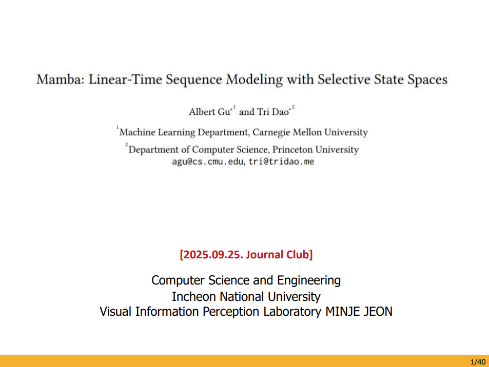

# 20250925-Journal Club - [Mamaba : Linear-Time Sequence Modelling with Selective State Spaces]
20250925-Journal Club - [Mamaba : Linear-Time Sequence Modelling with Selective State Spaces]

&nbsp;
<!-- TODO add the paper to something and link. -->

20250925-Journal Club - [Mamaba : Linear-Time Sequence Modelling with Selective State Spaces] PDF Here : [[PDF]](misc/250925_저널클럽_Mamba-SSM.pdf).
Source here! : https://github.com/state-spaces/mamba and PDF 41 Page!

@article{mamba,
  title={Mamba: Linear-Time Sequence Modeling with Selective State Spaces},
  author={Gu, Albert and Dao, Tri},
  journal={arXiv preprint arXiv:2312.00752},
  year={2023}
}

@inproceedings{mamba2,
  title={Transformers are {SSM}s: Generalized Models and Efficient Algorithms Through Structured State Space Duality},
  author={Dao, Tri and Gu, Albert},
  booktitle={International Conference on Machine Learning (ICML)},
  year={2024}
}

 
